# translate-overlay

A simple tool to translate texts on your screen that

- **Meant for Multilingual\***: Models that support multilingual are tested and picked for people around world to use. (\*Supported languages are subjected to chosen models. Check model list below for details.)

- **Meant for context**: Recognized texts are placed at same location as original texts are on your screen. You know where the text is and what it means.

- **Meant for unselectable texts**: Implemented OCR and text grouping let you translate texts where text selection is not available, whether it's in the image, video, or game.

- **No need for online subscription or API key**: This tool runs models downloaded from GitHub and Hugging Face. It can run fully and freely on local machine.

- **No need for GPU**: With smaller and quantized ONNX models, whole process can be done relatively fast without requiring dedicated GPU.

### Limitation

The tool is currently only designed to recognize horizontal machine-printed texts. Vertical, irregular-shaped or hand-written texts are not supported.

## Usage

1. Download any of the models for "Text Region Detection", "Text Recognition", and "Translation" in separated folders. Start program, select models and browse the paths. Choose "Target Language" you want to translate to, and the monitor you want Overlay to be shown on. 

    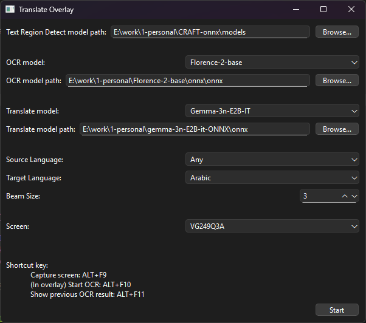

    - Increase beam size may improve quality, but will massively reduce running speed.
    - "Target Language" and "Screen" can be changed during using, without needing to restart the tool.

2. When ready, click "Start" button to load the models and activate the overlay.

    When models are being loaded, "Start" button is changed to "Starting" and disabled:

    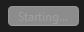

    When loading is done and overlay is ready, button is changed to "Stop" and enabled:

    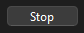

3. Use key combination "ALT + F9" to capture the current screen and show the overlay. Hold left key and drag to start OCR on selected area. Click on the recognized text to start translation. Use same key combination to quit overlay.

    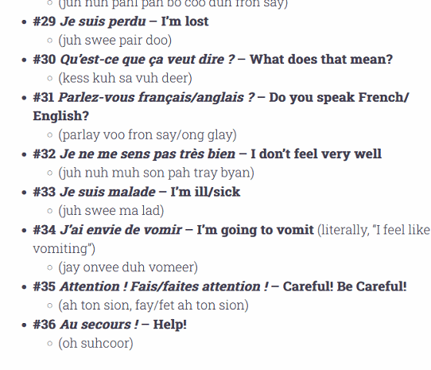

4. Left click on already translated text to switch back and forth between original and translated text. Right click on current displaying text to copy.

    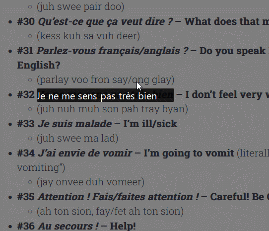

    - Use key combination "ALT + F11" to restore last result. Last result is overwritten every time OCR is performed on new screen capture.

6. When working with multi-line paragraphs, this tool comes with basic text grouping, but could yield incorrect result. Grouped texts come with extra layer of background. Left click while holding down "Ctrl" key to ungroup, then click and drag left key holding down "Ctrl" to group selected texts.

    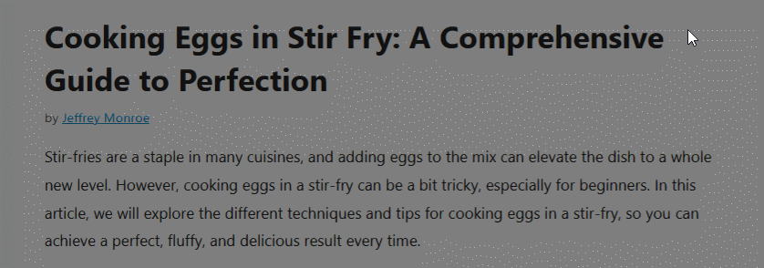

## Models

#### Text Region Detection

1. **CRAFT** (by Clova AI Research, NAVER Corp. [GitHub](https://github.com/clovaai/CRAFT-pytorch))

    ONNX model: https://github.com/frk-tt/CRAFT-onnx

    Download following files:
    - craftmlt25k.onnx
    - refine.onnx

    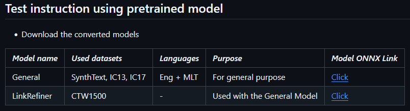

#### Text Recognition

1. **Florence-2-base** (by Microsoft. [Hugging Face](https://huggingface.co/microsoft/Florence-2-base))

    Supported languages: N/A (By personal test, only suppport major western languages like English, French, German, Spanish, etc.)

    ONNX model: https://huggingface.co/onnx-community/Florence-2-base

    Download following files:
    - config.json
    - preprocessor_config.json
    - processing_florence2.py
    - processor_config.json
    - tokenizer.json
    - embed_tokens_uint8.onnx
    - encoder_model_uint8.onnx
    - decoder_model_merged_uint8.onnx
    - vision_encoder_uint8.onnx

    From ONNX community Hugging Face link: 

    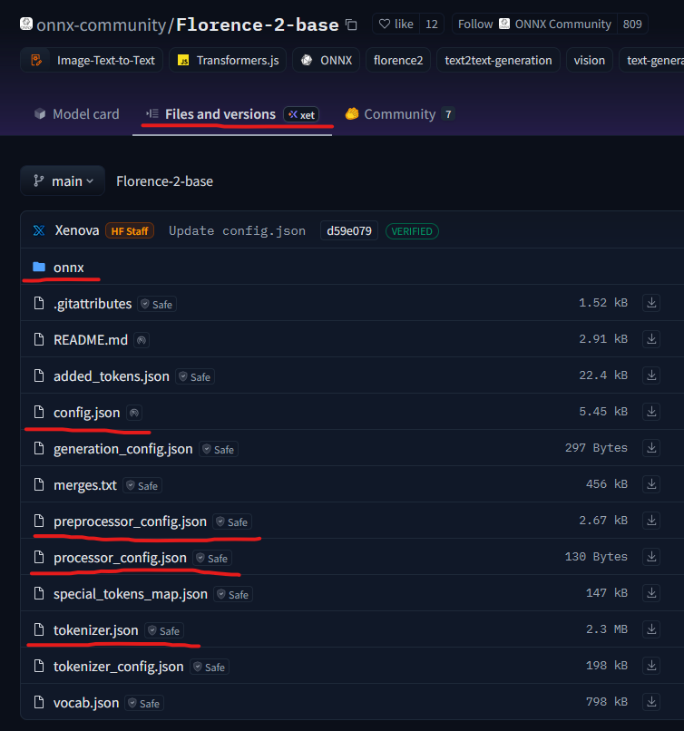

    From Microsoft Hugging Face link:

    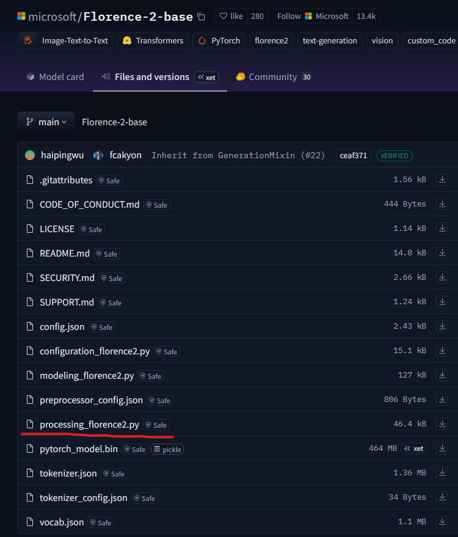

#### Translation

| Model            | File Size (Mem usage*) | Speed (Test speed*)  | Translation Quality                                                              |
|------------------|------------------------|----------------------|----------------------------------------------------------------------------------|
| MADLAD-400-3B-MT | 2.99 GB                | Fast (5.7 seconds)   | Machine Translation, limited contextual understanding and semantic precision     |
| Gemma-3-1B-IT    | 1.56 GB                | Medium (8.1 seconds) | Grammatically coherent, occasionally unnatural, incorrect or incomplete phrasing |
| Gemma-3n-E2B     | 3.82 GB                | Slow (17.35 seconds) | Context-aware, idiomatic, and stylistically polished                             |

*Mem Usage: Only measuring the memory after loading the model into the memory. Additional memory used by KV cache is not calculated.

*Test speed: Measured times are tested using code implementation in this repo on following hardware. Your mileage may vary:

    - System: Windows 11 24H2
    - CPU: AMD Ryzen 7 9700X 8 Core / 16 Threads
    - Memory: 32GB 6000 MT/s
    - Test input: 
        - Text: SciPy is a Python module that provides algorithms for mathematics, science, and engineering. It works with NumPy arrays and offers routines for statistics, optimization, integration, linear algebra, and more.
        - Target language: German

1. **MADLAD-400-3B-MT** (by Google. [Hugging Face](https://huggingface.co/google/madlad400-3b-mt))

    Supported languages: Madlad 400 Dataset & languages list: https://arxiv.org/pdf/2309.04662

    ONNX model: https://huggingface.co/ISoloist1/madlad400-3b-mt-onnx

    Download following files:
    - encoder_model_quantized.onnx
    - decoder_model_merged_quantized.onnx
    - spiece.model

    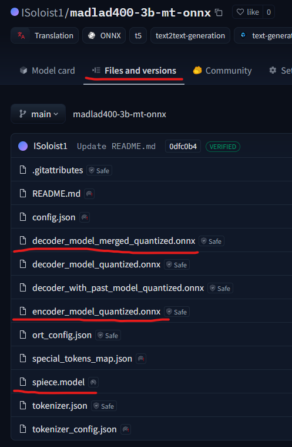

2. **Gemma-3-1B-IT** (by Google. [Hugging Face](https://huggingface.co/google/gemma-3-1b-it))

    Supported languages: Over 140 languages

    ONNX model: https://huggingface.co/onnx-community/gemma-3-1b-it-ONNX

    Download following files:
    - model_q4.onnx
    - tokenizer.json

    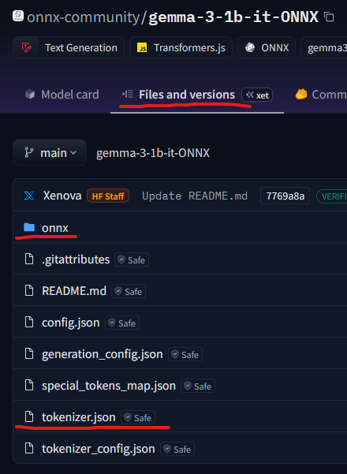

3. **Gemma-3n-E2B** (by Google. [Hugging Face](https://huggingface.co/google/gemma-3n-E4B))

    Supported languages: Over 140 languages

    ONNX model: https://huggingface.co/onnx-community/gemma-3n-E2B-it-ONNX

    Download following files:
    - embed_tokens_uint8.onnx
    - embed_tokens_uint8.onnx_data
    - decoder_model_merged_q4.onnx
    - tokenizer.json

    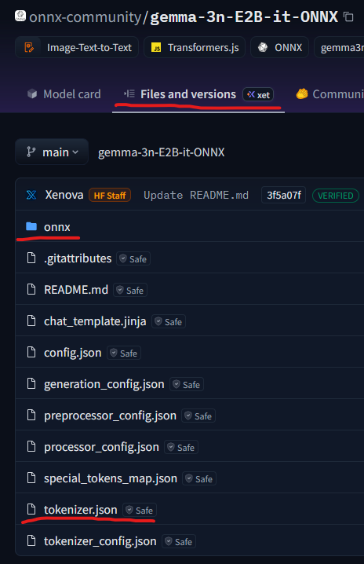

### Todo

- [ ] Create standalone executable.
- [ ] Migrate processing code for Florence 2 from Hugging Face and remove Transformer dependency.
- [ ] More options for text recognition for supporting more languages.
- [ ] Better error handling.
- [ ] Better text splitting.
